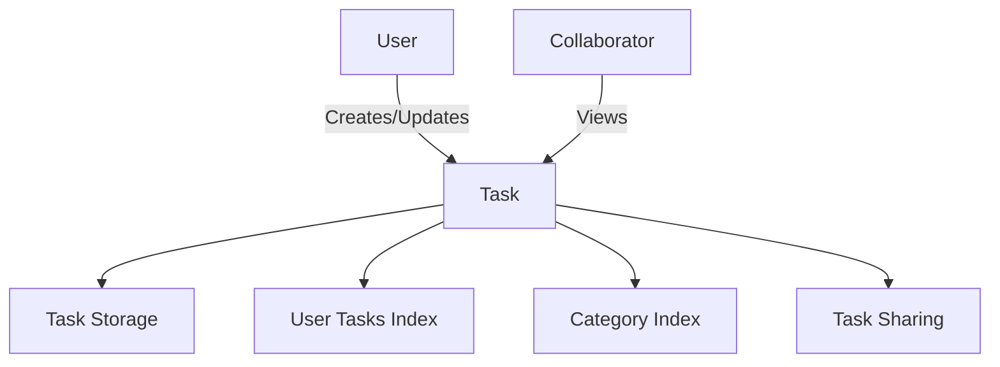

# TaskLoom Workflow Organizer

A decentralized task management system built on the Stacks blockchain that enables creative professionals to track, organize, and prioritize their work while maintaining full ownership of their workflow data.

## Overview

TaskLoom provides a blockchain-based solution for professionals who need a verifiable and secure way to manage their tasks and share work progress with clients or collaborators. The system stores all task data on-chain, creating an immutable record of work history and productivity.

### Key Features
- Create and manage tasks with detailed descriptions
- Set priority levels and deadlines
- Organize tasks by categories
- Share tasks with collaborators or clients
- Track task completion with blockchain timestamps
- Maintain verifiable work history

## Architecture

TaskLoom is built around a core smart contract that handles task management and sharing capabilities. The system uses various data maps to organize tasks and maintain relationships between users, tasks, and categories.



### Core Components
- Task Storage: Main storage for task details
- User Tasks Index: Maps users to their tasks
- Category Index: Organizes tasks by category
- Task Sharing: Manages task access permissions

## Contract Documentation

### Main Contract: taskloom.clar

The contract implements the core task management functionality with the following features:

#### Data Storage
- `tasks`: Main task storage mapping
- `user-tasks`: Index of tasks per user
- `category-tasks`: Index of tasks per category
- `task-sharing`: Sharing permissions for tasks

#### Access Control
- Task owners have full control over their tasks
- Shared users have read-only access
- Only task owners can modify or delete tasks

## Getting Started

### Prerequisites
- Clarinet
- Stacks wallet for deployment
- NodeJS environment for testing

### Installation
1. Clone the repository
2. Install dependencies
```bash
clarinet install
```
3. Test the contract
```bash
clarinet test
```

## Function Reference

### Task Management

```clarity
(create-task (title (string-ascii 100)) 
             (description (string-utf8 500))
             (category (string-ascii 50))
             (priority uint)
             (deadline uint))
```
Creates a new task with the specified details.

```clarity
(update-task (task-id uint)
             (title (string-ascii 100))
             (description (string-utf8 500))
             (category (string-ascii 50))
             (priority uint)
             (deadline uint))
```
Updates an existing task's details.

```clarity
(complete-task (task-id uint))
```
Marks a task as completed.

### Task Sharing

```clarity
(share-task (task-id uint) (share-with principal))
```
Shares a task with another user.

```clarity
(unshare-task (task-id uint) (unshare-from principal))
```
Removes sharing access for a user.

### Query Functions

```clarity
(get-task (task-id uint))
```
Retrieves task details by ID.

```clarity
(get-user-tasks (user principal))
```
Gets all tasks for a specific user.

## Development

### Testing
The contract includes various test scenarios covering:
- Task creation and management
- Access control
- Sharing functionality
- Error conditions

### Local Development
1. Start Clarinet console:
```bash
clarinet console
```
2. Deploy contract:
```bash
clarinet deploy
```

## Security Considerations

### Limitations
- Maximum of 100 tasks per user
- Maximum of 20 shared users per task
- Task titles limited to 100 ASCII characters
- Descriptions limited to 500 UTF-8 characters

### Best Practices
- Always verify task ownership before modifications
- Handle task sharing carefully to prevent unauthorized access
- Monitor transaction costs for task operations
- Validate all inputs before submission
- Keep task descriptions and titles within specified limits